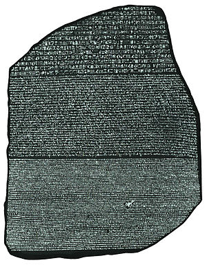

With the latest changes we finished a large part of the translation
infrastructure of Codepoints.net. There is also a German translation online
right now. It suffers from several edge cases, like wrong grammatical cases and
not translated Wikipedia articles and glossary terms. But the basic content of
the site is now ready to go multilingual.

If you are a native speaker of some language and want to lend us a hand in
translating the site to your own tongue, please contact us and we’ll be
happy to incorporate such a translation in here. Technically, we use GNU
Gettext to create and foster translation catalogs, plus one plain PHP file,
where translation strings for common Unicode terms are stored. If you
don’t know, what that means, we’re happy to assist you in getting
started with the appropriate tools. There should be close to no coding
experience necessary.
